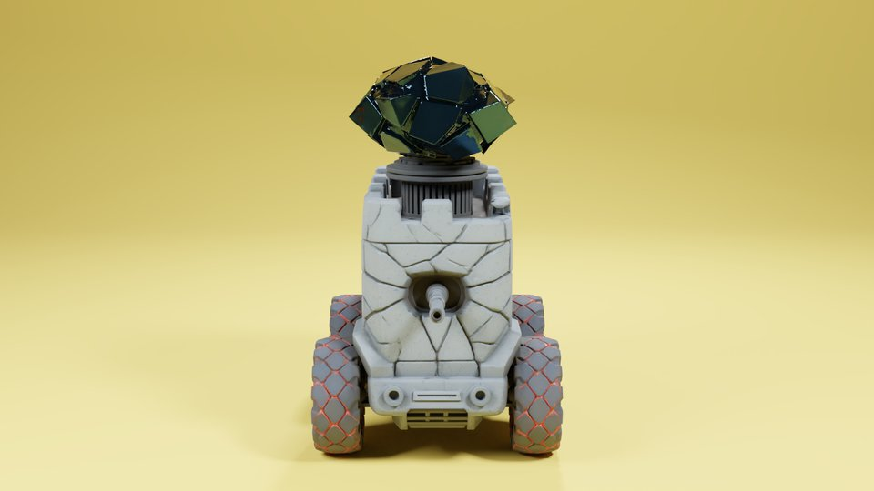
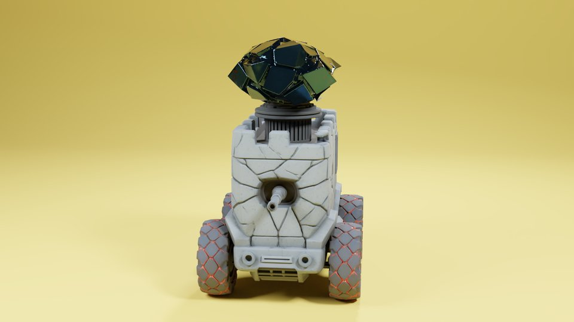
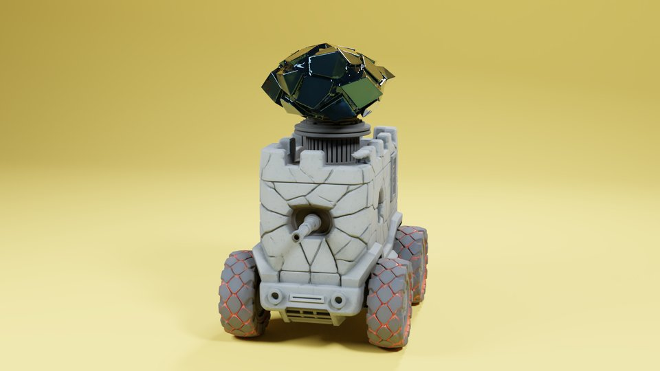
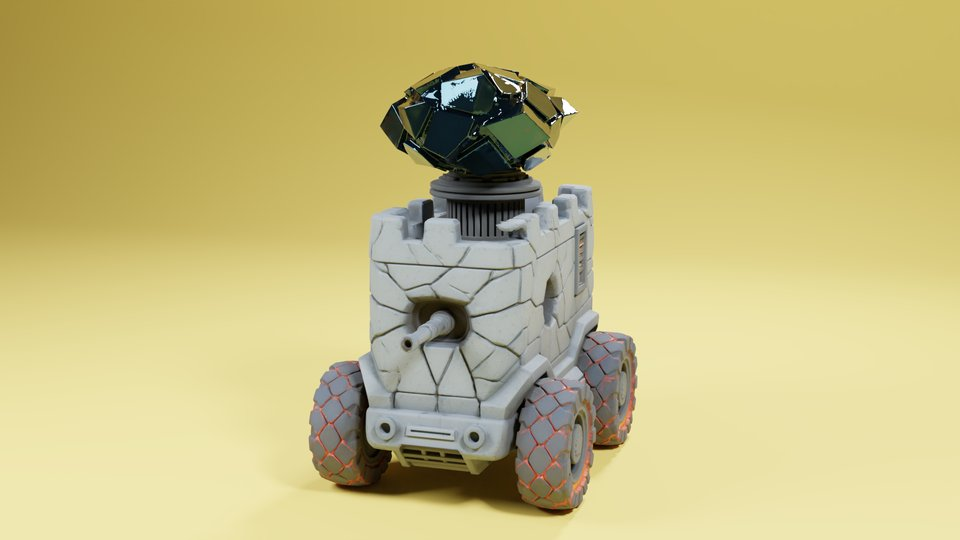
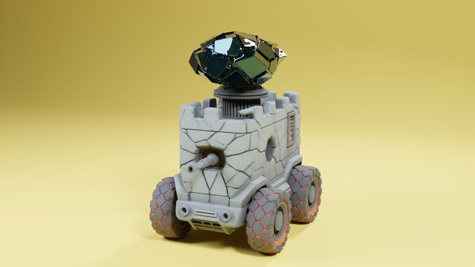

# FrameForge 3D - 首尾帧生成器

一键导入、修复、布光渲染 3D 模型，生成 AI 视频制作所需的首尾帧。

专为 AI 视频创作者设计 —— 把 3D 模型快速变成高质量渲染图，直接喂给 AI 视频生成工具。

> 作者：米醋电子工作室崔师傅
>
> **🚧 后续工作流版本持续更新中，欢迎 Star ⭐ 关注最新动态！**

## 渲染效果展示

360 度转盘渲染（影棚灯光 + 摄影棚弧形背景）：

<p align="center">
  
  
</p>
<p align="center">
  
  
</p>
<p align="center">
  
</p>

> 以上渲染由插件一键生成：导入模型 → 配置场景（影棚灯光 + 转盘相机 + 弧形背景）→ 渲染出图

---

## 功能一览

| 模块 | 功能 |
|------|------|
| **导入模型** | 支持 GLB / GLTF / FBX / OBJ / STL / PLY / USD 等 9 种格式，自动居中、缩放、按独立块或材质分离 |
| **自动修复** | 合并重叠顶点、修复法线、填补破面、自动减面，一键搞定 |
| **智能材质** | 自动扫描模型同目录贴图文件，识别 PBR 贴图类型（albedo / normal / roughness 等）并创建完整材质 |
| **灯光相机** | 影棚三点布光 / HDRI 环境光、正面 / 3/4 侧面 / 360 转盘 / 多角度相机，一键配置 |
| **摄影棚背景** | 弧形过渡背景（Cyclorama），支持自定义颜色和贴图，专业摄影棚效果 |
| **渲染出图** | 快速预览 / 产品级 / 批量模式 / 数字孪生，自动检测 GPU 加速 |
| **批量处理** | 指定文件夹，自动处理所有模型：导入 → 修复 → 材质 → 布光 → 渲染 |

---

## 安装

### 环境要求

- **Blender 4.5.0** 或更高版本

### 安装步骤

1. 下载 [最新 Release](../../releases) 中的 `ai_model_importer.zip`
2. 打开 Blender → **编辑** → **偏好设置** → **插件**
3. 点击右上角 **从磁盘安装**，选择下载的 zip 文件
4. 勾选启用 **FrameForge 3D - 首尾帧生成器**
5. 在 3D 视口侧边栏（按 `N` 键展开）找到 **FrameForge** 标签

---

## 快速上手

### 30 秒出图流程

```
导入模型 → 一键修复 → 自动材质 → 一键配置场景 → 渲染
```

### 详细步骤

#### 1. 导入模型

- 点击 **"选择模型文件导入"**，选择你的 3D 模型文件
- **推荐使用 GLB 格式**（自带贴图和材质，不会丢东西）
- 自动居中和缩放默认开启
- **自动分离**默认按独立块拆分，方便单独给每个部件上材质

> **注意**：STL 格式不支持材质和贴图。如果你的 AI 建模工具支持导出 GLB，优先选 GLB。

#### 2. 自动修复（可选）

展开 **"② 自动修复"** 面板：

- 选中模型 → 点击 **"一键修复模型"**
- 自动处理：重叠顶点、法线翻转、破洞、面数过多等常见问题

#### 3. 材质设置

展开 **"③ 材质设置"** 面板：

- 选中模型 → 点击 **"自动设置材质"**
- 如果模型文件旁边有贴图文件（如 `albedo.png`、`normal.png`），会自动识别并创建 PBR 材质
- 支持识别的贴图类型：

| 类型 | 识别关键词 |
|------|-----------|
| 基础色 | basecolor, albedo, diffuse, col, diff |
| 法线 | normal, norm, nrm, nor |
| 粗糙度 | rough, roughness, rgh |
| 金属度 | metal, metallic, met |
| 环境光遮蔽 | ao, ambient occlusion, occ |
| 高度 | height, bump, displacement, disp |
| 自发光 | emission, emissive, glow, emit |
| 透明度 | opacity, alpha, transparency |

> **提示**：查看材质效果需要切换到 **材质预览模式**（按 `Z` 键选择 Material Preview）。

#### 4. 灯光、相机和背景

展开 **"④ 灯光和相机"** 面板：

**灯光方案：**
- **影棚灯光** — 专业三点布光（主光 + 补光 + 背光），适合产品展示
- **环境光 (HDRI)** — 使用 HDRI 图片做真实环境照明，可自定义文件、强度和旋转
- **不设置** — 不添加灯光

**相机角度：**
- **正面** — 正前方直视
- **3/4 侧面** — 经典产品展示角度
- **转盘动画** — 360 度旋转展示（可设置帧数）
- **多角度** — 前、后、左、右、顶 5 个视角
- **不设置** — 不添加相机

**摄影棚背景：**
- 勾选 **"启用背景"** 添加弧形过渡背景
- 可自定义背景颜色（默认浅灰）
- 可选择贴图文件作为背景纹理

选好后点击 **"一键配置场景"**，然后按 **Numpad 0** 查看相机视角。

> **提示**：重新配置场景时会自动清理上次生成的灯光、相机和背景，不会重复叠加。

#### 5. 渲染出图

展开 **"⑤ 渲染出图"** 面板：

| 预设 | 引擎 | 分辨率 | 适用场景 |
|------|------|--------|---------|
| 快速预览 | EEVEE | 1280x720 | 快速看效果 |
| 产品级 | Cycles | 1920x1080 | 最终出图，质量最高 |
| 批量模式 | EEVEE | 1920x1080 | 批量处理，平衡速度和质量 |
| 数字孪生 | EEVEE | 1280x720 | 实时预览 |

设置输出文件夹 → 点击 **"开始渲染"**。

#### 6. 批量处理（可选）

展开 **"⑥ 批量处理"** 面板：

1. 选择包含多个模型的文件夹
2. 设置输出文件夹
3. 勾选需要执行的步骤（导入 / 修复 / 材质 / 渲染）
4. 点击 **"开始批量处理"**

插件会自动遍历文件夹中所有支持的模型文件，逐个执行完整流程，并在输出文件夹生成 JSON 格式的处理报告。

---

## 支持的模型格式

| 格式 | 扩展名 | 材质支持 | 推荐度 |
|------|--------|---------|--------|
| glTF Binary | `.glb` | 内嵌完整 PBR | ★★★ 首选 |
| glTF | `.gltf` | 引用外部贴图 | ★★★ |
| FBX | `.fbx` | 内嵌材质 | ★★☆ |
| USD | `.usd` `.usda` `.usdc` `.usdz` | 支持材质 | ★★☆ |
| OBJ | `.obj` | 需要 .mtl 文件 | ★☆☆ |
| PLY | `.ply` | 顶点色 | ★☆☆ |
| STL | `.stl` | 不支持 | ☆☆☆ 不推荐 |

---

## 推荐的 AI 3D 建模工具

以下工具可以生成带贴图的 3D 模型，导出 GLB 格式后配合本插件使用效果最佳：

- [Meshy](https://meshy.ai) — 文字 / 图片生成 3D，自带 PBR 贴图
- [Tripo3D](https://tripo3d.ai) — 图片转 3D，质量不错
- [Rodin (Hyper)](https://hyper.ai) — 高质量带贴图模型
- [Trellis (微软开源)](https://github.com/microsoft/TRELLIS) — 可本地部署

> 导出时务必选择 **GLB 格式**，这样贴图会打包在模型文件内，导入即可用。

---

## 项目结构

```
ai_model_importer/
├── __init__.py              # 插件注册入口
├── properties.py            # 所有用户可配置属性
├── operators/
│   ├── import_ops.py        # 导入操作
│   ├── fix_ops.py           # 模型修复操作
│   ├── material_ops.py      # 材质设置操作
│   ├── scene_ops.py         # 场景配置操作（灯光/相机/背景）
│   ├── render_ops.py        # 渲染操作
│   └── batch_ops.py         # 批量处理操作
├── panels/
│   └── main_panel.py        # UI 面板布局
├── presets/
│   └── render_presets.py    # 渲染预设配置
└── utils/
    ├── import_utils.py      # 导入、居中、缩放、分离
    ├── mesh_utils.py        # 网格修复管道
    ├── material_utils.py    # 材质检测、PBR 创建、贴图扫描
    ├── scene_utils.py       # 灯光、相机、转盘、背景生成
    └── report_utils.py      # JSON 报告生成
```

---

## 开发

### 本地开发

1. 克隆仓库
2. 在 Blender 偏好设置中把 `ai_model_importer` 文件夹路径添加到脚本目录
3. 重启 Blender，启用插件
4. 修改代码后，在 Blender 中按 `F3` → 搜索 "Reload Scripts" 重新加载

### 打包发布

将 `ai_model_importer` 文件夹打包为 zip：

```bash
zip -r ai_model_importer.zip ai_model_importer/ -x "*__pycache__*" "*.pyc"
```

---

## 许可证

[MIT License](LICENSE)

---

## 致谢

- [Blender](https://www.blender.org/) — 开源 3D 创作套件
- 米醋电子工作室
